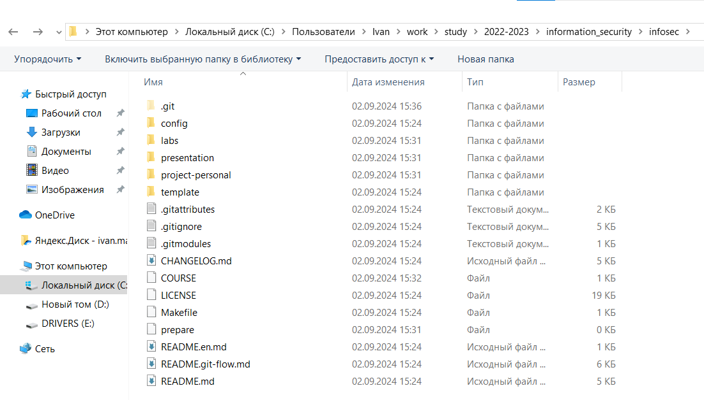
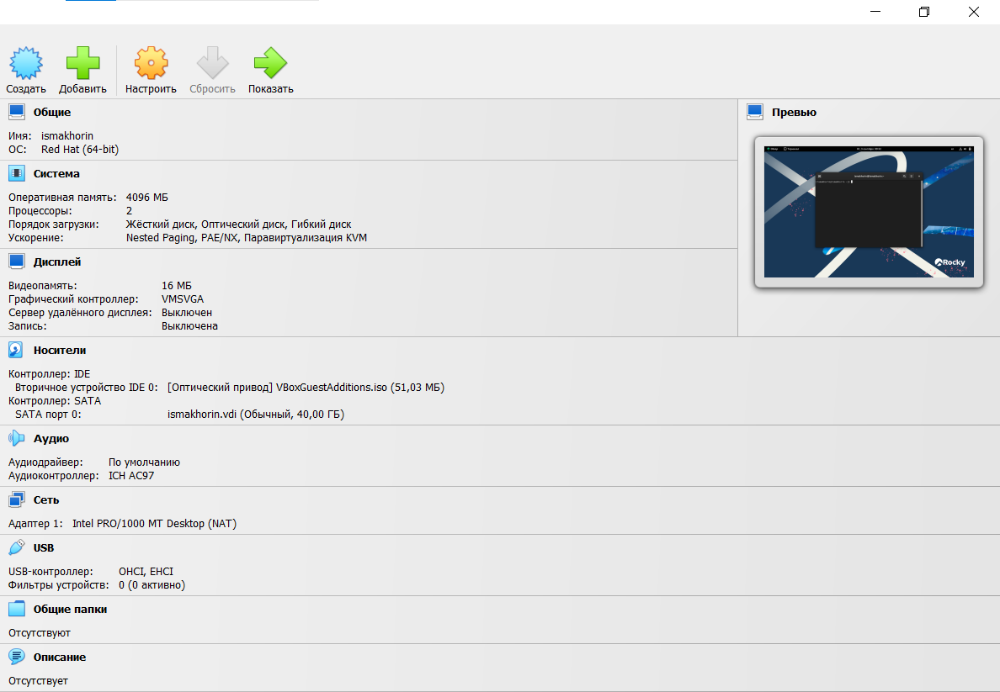
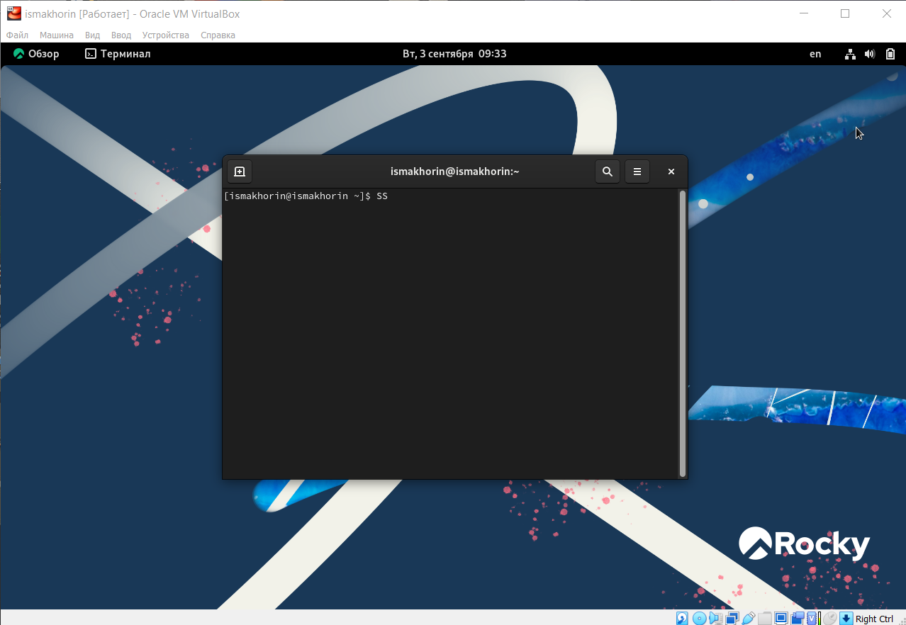

---
## Front matter
lang: ru-RU
title: Лабораторная работа №1
subtitle: Информационная безопасность
author:
  - Махорин И. С.
institute:
  - Российский университет дружбы народов имени Патриса Лумумбы, Москва, Россия
date: 2024

## i18n babel
babel-lang: russian
babel-otherlangs: english

## Formatting pdf
toc: false
toc-title: Содержание
slide_level: 2
aspectratio: 169
section-titles: true
theme: metropolis
header-includes:
 - \metroset{progressbar=frametitle,sectionpage=progressbar,numbering=fraction}
 - '\makeatletter'
 - '\beamer@ignorenonframefalse'
 - '\makeatother'
---

## Докладчик

:::::::::::::: {.columns align=center}
::: {.column width="70%"}

  * Махорин Иван Сергеевич
  * Студент группы НПИбд-02-21
  * Студ. билет 1032211221
  * Российский университет дружбы народов имени Патриса Лумумбы

:::
::: {.column width="30%"}

:::
::::::::::::::

## Цель лабораторной работы

- Настроить рабочее пространство для лабораторных работ, приобрести практические навыки
установки операционной системы на виртуальную машину и настройки минимально необходимых для дальнейшей работы сервисов
- Изучить идеологию и применение средств контроля версий, освоить умения по работе с git
- Научиться оформлять отчёты с помощью легковесного языка разметки Markdown

## Теоретическая справка

- **Oracle VM VirtualBox** — мощная и бесплатная виртуализационная платформа, разработанная корпорацией Oracle, которая позволяет пользователям создавать и управлять виртуальными машинами на своих компьютерах

## Теоретическая справка

- **Git** — система управления версиями с распределенной архитектурой. В отличие от некогда популярных систем вроде CVS и Subversion (SVN), где полная история версий проекта доступна лишь в одном месте, в Git каждая рабочая копия кода сама по себе является репозиторием. Это позволяет всем разработчикам хранить историю изменений в полном объеме

## Теоретическая справка

- **Markdown** — облегчённый язык разметки, созданный с целью обозначения форматирования в простом тексте, с максимальным сохранением его читаемости человеком, и пригодный для машинного преобразования в языки для продвинутых публикаций (HTML, Rich Text и других)

# Ход выполнения лабораторной работы

## Настройка рабочего пространства

{width=80% height=80% }

## Установка и конфигурация операционной системы на виртуальную машину

{width=80% height=80% }

## Установка и конфигурация операционной системы на виртуальную машину

{width=80% height=80% }

# Вывод

## Вывод

- Было настроено рабочее пространство для лабораторных работ, приобретены практические навыки
установки операционной системы на виртуальную машину и настройки минимально необходимых для дальнейшей работы сервисов.
- Были изучены идеология и применение средств контроля версий, освоены умения по работе с git.
- Были приобретены практические навыки оформляения отчётов с помощью легковесного языка разметки Markdown.

# Список литературы. Библиография

[1] Документация по Virtual Box: https://www.virtualbox.org/wiki/Documentation

[2] Документация по Git: https://git-scm.com/book/ru/v2

[3] Документация по Markdown: https://learn.microsoft.com/ru-ru/contribute/markdown-reference