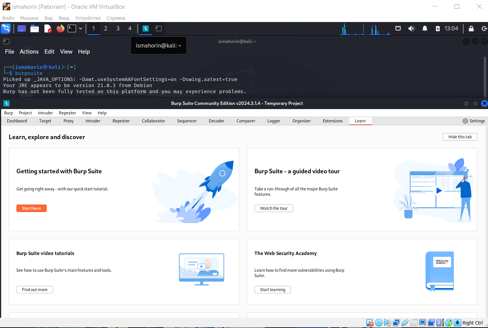

---
## Front matter
title: "Отчёт по 5 этапу индивидуального проекта

Информационная безопасность"
subtitle: "Использование Burp Suite"
author: "Выполнил: Махорин Иван Сергеевич, 

НПИбд-02-21, 1032211221"

## Generic otions
lang: ru-RU
toc-title: "Содержание"

## Bibliography
bibliography: bib/cite.bib
csl: pandoc/csl/gost-r-7-0-5-2008-numeric.csl

## Pdf output format
toc: true # Table of contents
toc-depth: 2
lof: true # List of figures
fontsize: 12pt
linestretch: 1.5
papersize: a4
documentclass: scrreprt
## I18n polyglossia
polyglossia-lang:
  name: russian
  options:
	- spelling=modern
	- babelshorthands=true
polyglossia-otherlangs:
  name: english
## I18n babel
babel-lang: russian
babel-otherlangs: english
## Fonts
mainfont: PT Serif
romanfont: PT Serif
sansfont: PT Sans
monofont: PT Mono
mainfontoptions: Ligatures=TeX
romanfontoptions: Ligatures=TeX
sansfontoptions: Ligatures=TeX,Scale=MatchLowercase
monofontoptions: Scale=MatchLowercase,Scale=0.9
## Biblatex
biblatex: true
biblio-style: "gost-numeric"
biblatexoptions:
  - parentracker=true
  - backend=biber
  - hyperref=auto
  - language=auto
  - autolang=other*
  - citestyle=gost-numeric
## Pandoc-crossref LaTeX customization
figureTitle: "Рис."
tableTitle: "Таблица"
listingTitle: "Листинг"
lofTitle: "Список иллюстраций"
lolTitle: "Листинги"
## Misc options
indent: true
header-includes:
  - \usepackage{indentfirst}
  - \usepackage{float} # keep figures where there are in the text
  - \floatplacement{figure}{H} # keep figures where there are in the text
---

# Цель работы

Научиться использовать Burp Suite.

# Выполнение индивидуального проекта

## Работа с Burp Suite

Burp Suite представляет собой набор мощных инструментов безопасности вебприложений, которые демонстрируют реальные 
возможности злоумышленника, проникающего в веб-приложения. Эти инструменты позволяют сканировать, анализировать и 
использовать веб-приложения с помощью ручных и автоматических методов. Интеграция интерфейсов этих инструментов 
обеспечивает полную платформу атаки для обмена информацией между одним или несколькими инструментами, что делает 
Burp Suite очень эффективной и простой в использовании платформой для атаки веб-приложений.

При первом запуске нам будет предложено принять условия и настроить среду проекта.

Через терминал запустим Burp Suite

{ #fig:001 width=100% height=100% }

На экране появилось окно Burp Suite. Все интегрированные инструменты:

- Target (Цель) 
- Proxy (Прокси)
- Spider (Паук)
- Scanner (Сканер)
- Intruder (Злоумышленник)
- Repeater (Ретранслятор)
- Sequencer (Планировщик)
- Decoder (Декодер)
- Compared (Сравнение)

будут доступны на отдельных вкладках. Мы можем получить более подробную информацию об их использовании и конфигурации, 
выбрав команду меню Help (Справка) или посетив сайт http://www.portswigger.net/burp/help/.

Обратим внимание, что Burp Suite доступен в трех версиях: 

- Free (Community)
- Professional
- Enterprise

В Kali установлена версия Free (Community). Burp Suite поставляется со встроенным поисковым роботом Spider. 
Это приложение, представляющее из себя бот, систематически просматривающий целевой сайт вместе со всеми внутренними 
страницами и отображающий его структуру.

# Вывод

В ходе выполнения индивидуального проекта были приобретены практические навыки использования Burp Suite.

# Список литературы. Библиография

[1] Документация по этапам индивидульного проекта:  Парасрам Шива, Замм Алекс, Хериянто Теди, Али Шакил, Буду Дамиан, 
Йохансен Джерард, Аллен Ли П18 Kali Linux. Тестирование на проникновение и безопасность. — СПб.: Питер, 2020. — 448 с.: 
ил. — (Серия «Для профессионалов»). ISBN 978-5-4461-1252-4
